<div align="center">

<!-- ▰▰▰▰▰▰▰▰▰▰▰▰ HEADER ▰▰▰▰▰▰▰▰▰▰▰▰ -->



<br/>

<!-- ▰▰▰▰▰▰▰▰▰▰▰▰ BOOT SEQUENCE ▰▰▰▰▰▰▰▰▰▰▰▰ -->


<br/>

<!-- ▰▰▰▰▰▰▰▰▰▰▰▰ DIVIDER ▰▰▰▰▰▰▰▰▰▰▰▰ -->


<br/>

<!-- ▰▰▰▰▰▰▰▰▰▰▰▰ CHARACTER CARD ▰▰▰▰▰▰▰▰▰▰▰▰ -->

<table>
<tr>
<td align="center" width="180">

```


         ████████
        ██▓▓▓▓▓▓██
        ██▓▓██▓▓██
        ██▓▓▓▓▓▓██
        ██▓▓━━▓▓██
        ██▓▓▓▓▓▓██
         ██▓▓▓▓██
      ████▓▓▓▓████
      ██ ████████ ██
        ██    ██
       ████  ████
```


</td>
<td align="center">

```


   ╔═════════════════════════════════════╗
   ║                                     ║
   ║   IDENTITY:  [REDACTED]             ║
   ║   CLASS:     Code Phantom           ║
   ║   LEVEL:     ████████░░  ??         ║
   ║                                     ║
   ║   HP    ████████████░░░░  78%       ║
   ║   COFFEE████████████████  100%      ║
   ║   DEBUG ██████░░░░░░░░░░  38%       ║
   ║   LUCK  ██████████████░░  92%       ║
   ║                                     ║
   ║   STATUS: lurking in the terminal   ║
   ║                                     ║
   ╚═════════════════════════════════════╝
```


</td>
</tr>
</table>

<br/>

<!-- ▰▰▰▰▰▰▰▰▰▰▰▰ TECH ▰▰▰▰▰▰▰▰▰▰▰▰ -->


<br/>


<br/>

<!-- ▰▰▰▰▰▰▰▰▰▰▰▰ DIVIDER ▰▰▰▰▰▰▰▰▰▰▰▰ -->


<br/>

<!-- ▰▰▰▰▰▰▰▰▰▰▰▰ STATS ▰▰▰▰▰▰▰▰▰▰▰▰ -->


<br/>

<table>
<tr>
<td align="center">


</td>
<td align="center">


</td>
</tr>
</table>


<br/>

<!-- ▰▰▰▰▰▰▰▰▰▰▰▰ TROPHY ▰▰▰▰▰▰▰▰▰▰▰▰ -->

<a href="https://github.com/wumuwutu">

</a>

<br/>

<!-- ▰▰▰▰▰▰▰▰▰▰▰▰ CONNECT ▰▰▰▰▰▰▰▰▰▰▰▰ -->


<br/>

[](https://github.com/wumuwutu)
[](mailto:wumuwutu@users.noreply.github.com)

<br/>
<br/>

<!-- ▰▰▰▰▰▰▰▰▰▰▰▰ FOOTER ▰▰▰▰▰▰▰▰▰▰▰▰ -->


</div>
